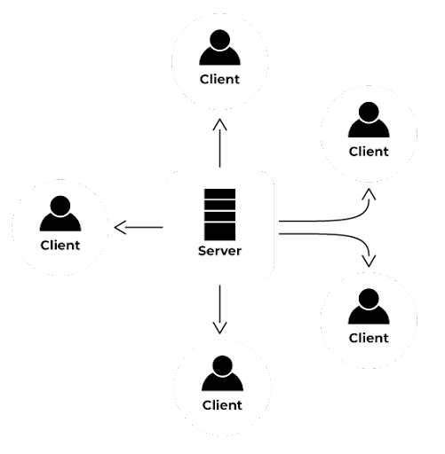
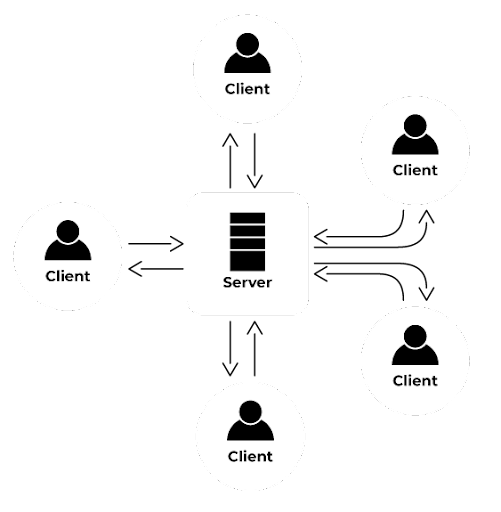
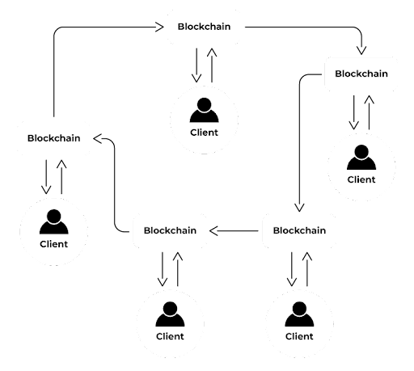
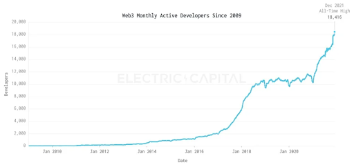
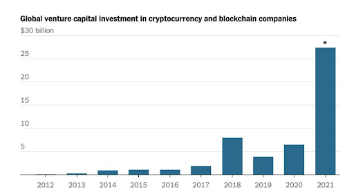

## World Wide Web

Web1 was a read-only content delivery network. The user couldn’t interact with the page content as it was limited to what the content owner uploaded to the website.

Web2 offers read and write capabilities, but has quickly become  dominated by technology giants and social media. The Web becomes interactive, but the content is still stored centralized.

Data leaks, account restrictions and censorship has caused a quick spike in adoption of the concept of trustless decentralized control over content and assets on the web.

Today, blockchain technology brings trustless decentralized control over users' content and assets. Blockchains store a history of transactions between all parties in the network so everyone has access and is able to verify it. Distributed ledgers make it resource-prohibitive to forge or delete data without the consent of the data owner.

Blockchain technology launched a rapid transition from centralized, server-based internet (Web2) to a decentralized, distributed one - **Web3**. Its distinctive features are: no single point of failure (the network can still function even if a large proportion of participants are attacked/taken out), censorship resistance, anyone in the network has the possibility to use the service (permissionless).

**Web3** introduces new types of decentralized applications (dApps) and assets such as:  decentralized finances (DeFi), decentralized currency exchanges (DEX), decentralized marketplaces and gaming platforms, NFTs, Social Tokens and more.

This generates growth of engagement and adoption in the **Web3** ecosystem from developers, entrepreneurs and investors. Today **Web3** developers are at an all-time high demand and their activity is growing faster than ever.

Even though the mass adoption of **Web3** is only just getting started, venture capital demonstrates a rapid investment growth toward **Web3** projects.

Gear’s mission is to become an essential platform for building the **Web3** ecosystem.

## First blockchains

At their core, blockchains store a history of transactions between parties in a form that can be accessible by anybody. The key strengths of the blockchain in general are:
- _Decentralized_ - central authority maintaining the ledger of transactions.
- _Immutable_ — once the transaction is committed, it cannot be changed or altered.
- _Open_ - everyone is able to view a transaction.

The very first mass-adopted blockchain, Bitcoin, has a single purpose - to provide a decentralized network that allows people to transfer and exchange value.

Ethereum was a breakthrough technology built after Bitcoin. Its main intention is to provide a Layer-1 platform that allows developers to create decentralized applications. This breakthrough was done thanks to the introduction of the Smart Contract, which allowed not only to transfer or store value, but also to generate applications and add logic conditions. The constant rising in transaction costs gave birth to several blockchains with similar capabilities, but different applications. 
Some of the issues with the second generation of blockchain networks:
- Lack of scalability, low transaction speed, high transaction costs
- Domain-specific development language (high barrier to entry)
- Complex and inefficient native consensus protocols
- Absence of intercommunication tools

Moreover, the proof-of-work consensus mechanism, that Bitcoin and a lot of these Layer-1 networks use, consumes a lot of energy to produce transaction blocks which automatically replicate on the network and computational transaction costs. This mechanism is widely criticized for its excess carbon footprint.

## Smart contracts

In order to build applications on a blockchain, the concept of smart contracts was adopted.

Smart contract is a transaction protocol with deterministic execution, thus built-in security. Smart Contract in Web3 is an equivalent of a microservice in Web2 which is stored on the blockchain network and is an essential building block of a decentralized application.

Blockchain guarantees immutability and, therefore, stability and reliability of a service provided with a smart contract. Often blockchain applications are composed of one or more smart contracts that complement each other.

Nowadays, we can find numerous languages and frameworks that allow for smart contract development, each having its own drawbacks.

## Modern blockchains

Modern blockchains offer significant improvements such as - infinitely more energy efficient proof-of-stake consensus mechanisms; community-based authority with DAOs;
fast and cost-effective smart contract engines due to the introduction of WebAssembly. WebAssembly is also a developer-friendly virtual machine, as many general-purpose programming languages compile on it.

Still a lack of interoperability with other networks remains room for improvements.
